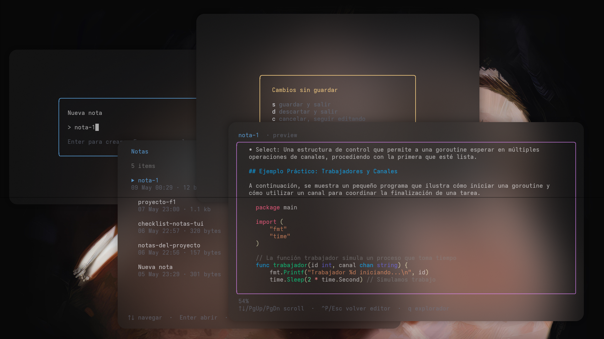

# notas-tui

A lightweight, terminal-based note-taking application built in Go with a beautiful TUI (Text User Interface). Take quick notes directly from your terminal with an intuitive and responsive design.



## Features

- 📝 **Quick Note Taking** - Create and manage notes directly from your terminal
- 🎨 **Beautiful TUI Design** - Modern, user-friendly terminal interface
- ⚡ **Lightweight** - Fast and efficient, minimal resource usage
- 🔧 **Simple & Intuitive** - Easy to use, no steep learning curve
- 🚀 **Written in Go** - Fast performance and easy installation

## Installation

### From Source

```bash
git clone https://github.com/Radashi/notas-tui.git
cd notas-tui
go build
```

### From Releases

Download the latest release from [GitHub Releases](https://github.com/Radashi/notas-tui/releases)

## Usage

```bash
./notas-tui
```

## Getting Started
In the explorer
- N - New note
- D - Delete note
- / - Search note
- Enter - Open note
- Down/Up - Select note 
- Q - Exit

In the editor
- CTRL-S - Save note
- CTRL-F - Search a word in the note
- CTRL-P - Markdown preview
- ESC - Exit (in case you didn't save you ill have a warning)

In the preview
- CTRL-P - Get back to editor
- Q - Get back to explorer
- Up/Down/PgUp/PgDn - Move the preview
  
## Requirements

- Go 1.16 or higher (for building from source)

## Contributing

Contributions are welcome! Please feel free to submit a Pull Request.

## Support

For issues, questions, or suggestions, please open an [issue](https://github.com/Radashi/notas-tui/issues).
Or contact me. **yes i used copilot for this readme**

---

Made with ❤️ by [Radashi](https://github.com/Radashi)
